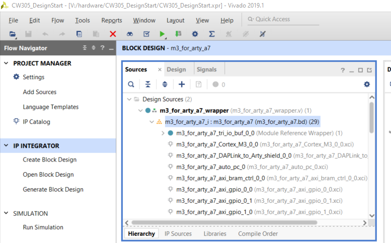
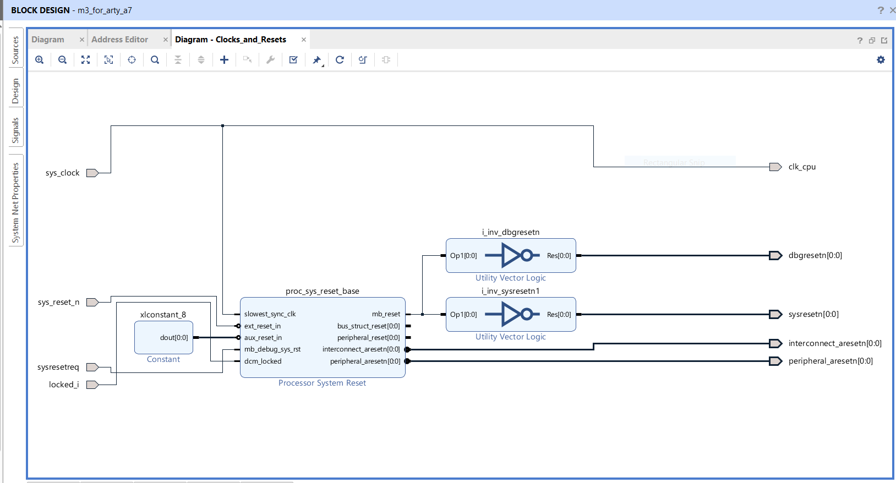
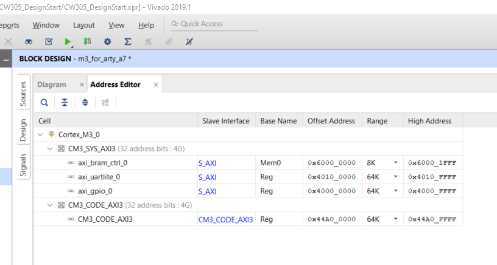
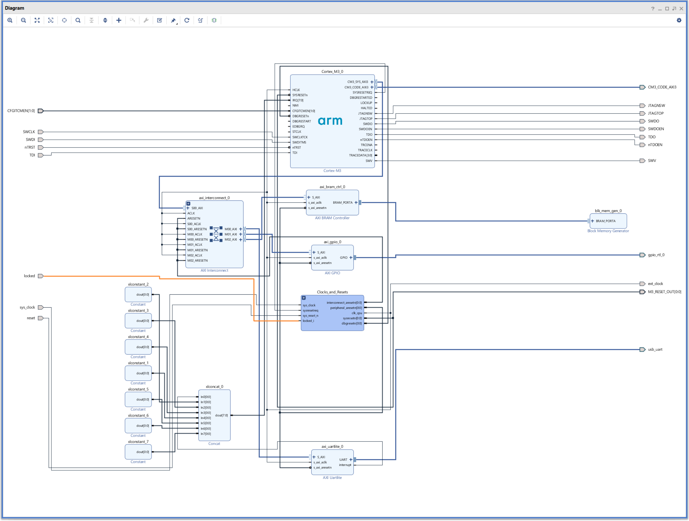
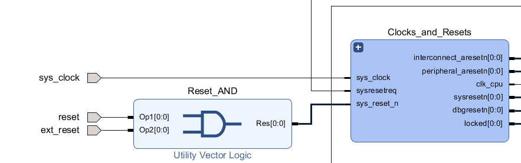

# Introduction

Arm freely provides its Cortex M1 and Cortex M3 processors as soft-core IP for
evaluation through its
[DesignStart](https://www.arm.com/resources/free-arm-cortex-m-on-fpga)
program. This will require one to both *Apply* and sign-up. Arm also
provides a workflow and tutorials for implementing the
M1 or M3 on the popular [Digilent Arty
A7](https://reference.digilentinc.com/reference/programmable-logic/arty-a7/start)
FPGA platform.

In this note we explain how to port the Arty DesignStart platform to our
own [CW305](https://rtfm.newae.com/Targets/CW305%20Artix%20FPGA/) platform.
We show how to generate the FPGA bitfile, then we show how to build our
[standard simpleserial AES victim
firmware](https://github.com/newaetech/chipwhisperer/tree/develop/hardware/victims/firmware/simpleserial-aes) and run our standard Jupyter tutorials.

The end result is a powerful side-channel platform with a customizable Arm
Cortex target, which you can use as a starting point and customize for your
own needs. Here are a few examples of what you can do:

- add additional peripherals and interfaces to the Arm processor
- instantiate multiple Arm processors
- add additional side-channel attack logic to the CW305 FPGA -- for example,
  [Arm trace sniffing logic](https://github.com/newaetech/DesignStartTrace).

Before starting, it's a good idea to watch the series of videos that Arm put
together to show the development cycle for DesignStart on the Arty board:
https://youtu.be/kSaQJGSu-yI

This will give you an idea of what's possible and what the development cycle
is like.


## Warning!
Porting the Arm IP from the Arty platform to the CW305 platform requires you
to do a lot of work in Vivado. This write-up assumes some prior experience
with Vivado.  It is not a Vivado tutorial! Vivado can be a fickle tool and
its error messages will have you scratching your head if you aren't familiar
with FPGA development. Attempting to follow the steps below without any FPGA
development experience is almost guaranteed to be a frustrating experience.
The instructions below are very long and fairly detailed, but they are not
intended for beginners.

On the other hand, if you've used Vivado before, then don't let this scare
you away. You probably won't be doing anything you haven't done before!
For an experienced FPGA developer, there's nothing hard or tricky here. The
intent of this note is to show that it *is* possible to run DesignStart on
the CW305, and hopefully save you some time in getting there.


## Limitations
- The Cortex processors included in the DesignStart release have limited
  configuration options.
- The free version of Keil does not support programs larger that 32 Kbytes (the
  free version includes a 30-day trial for the unlimited professional version).

# Requirements
## Hardware Requirements:
- CW-Nano, Lite or Pro
- CW305

## Software Requirements:
These are all free downloads:
- Xilinx Vivado version 2019.1
    * other versions may work but some tweaks to the steps may be required
    * Xilinx makes it easy to install arbitrary versions, so please use
      2019.1!
- Keil uVision version 5.26.2.0
    * current version is 5.30, should work as well
- Arm DesignStart for Xilinx FPGA package

While Vivado is available for Windows and Linux, Keil is Windows-only.
The recipe provided here was tested with Windows 10.

### Install Xilinx Vivado

Create a Xilinx account and download Vivado Design Suite 2019.1 from 
https://www.xilinx.com/support/download/index.html/content/xilinx/en/downloadNav/vivado-design-tools/archive.html.
You should select the original 2019.1 release, *not* the update 1 or update 2
version.  You want the one where the Windows installer has this MD5 checksum:

`743003070fb77857ad098bd6873bdf0b`

When you run the installer, choose the the Vivado HL WebPACK install.

Other versions of Vivado may work as well, but the Vivado project files
provided by Arm were created with this version of Vivado; there may be
hiccups if you use a different version (in particular, the Xilinx SDK
appears to have undergone significant changes in 2019.2).

### Download DesignStart package

Create an Arm account and download the DesignStart package 
from https://www.arm.com/resources/free-arm-cortex-m-on-fpga.

You have the option of choosing the M1 package or the M3 package. These
instructions are written for the M3 target, but they will work for the M1
target as well -- just substitute M3 for M1 wherever you encounter it in the
steps below.

The M3 fits on the XC7A100 FPGA with lots of room to spare for other logic
(approximately 20% utilization); it may be tight on the XC7A35 FPGA. The M1
should fit very comfortably on both.

These instructions were developed and tested with version r0p1-00-rel0.

### Install Keil
Download and install the Keil IDE from
https://www.keil.com/demo/eval/arm.htm.


# Creating the CW305 FPGA bitfile
This is by far the longest step, so buckle in. 

We're going to remove some unnecessary peripherals around the reference
Cortex design and change the configuration of others. The goal is to make a
target which resembles our STM32 targets, which communicate with
ChipWhisperer via UART. This will allow our existing Jupyter notebook
tutorials to be very easily ported to this platform.

(Other approaches are possible too! That's the beauty of having the target as
soft IP in an FPGA. For example one may choose to leverage the 8-bit
parallel data interface provided by 
[CW305.py](https://github.com/newaetech/chipwhisperer/blob/develop/software/chipwhisperer/capture/targets/CW305.py),
or make up an entirely new interface.)


1. Open the Arm DesignStart user guide
(`<Arm bundle>/docs/arm_cortex_m3_designstart_fpga_xilinx...pdf`)
and follow the instructions in sections 2.1, 2.2, and 2.3.


2. Clone the DesignStart project in Vivado:
   - Open Vivado and open either the DesignStart project, found here:
     `v:/hardware/m3_for_arty_a7/m3_for_arty_a7/*xpr`
   - There will be some warnings; this is ok.
   - File > Project > Save As, with a new project name of
     CW305\_DesignStart, to `V:/hardware/CW305_DesignStart` as shown below:  
   

2. Copy `v:/software/m3_for_arty_a7/` to `v:/software/CW305_DesignStart`

3. Follow the instructions in section 2.4 of the Arm DesignStart user guide,
   but replace `m3_for_arty_a7` with `CW305_DesignStart`. Make sure `Arty A7-100`
   is selected at `Tools -> Settings -> Project Settings -> General -> Project device` afterwards.
   It will display a message to your upgrade IP blocks. Here you can upgrade using the default settings.

5. Do not follows steps 2.5 and 2.6:
    - Step 2.5 is not necessary because our CW305 port does not use QSPI
      memory.
    - Step 2.6 is not necessary because we will not be simulating our CW305
      port in Vivado. (You, on the other hand, may wish to do so --
      especially if you decide to deviate from this recipe.)

6. Restart Vivado. Then in Vivado, update the block diagram. There is a *very long* list of
   changes to make! At the end of the changes, we'll show a picture of what
   the updated block diagram should look like, so that you can double-check
   that you've made all the changes correctly.
    - Double click on the block diagram file `m3_for_arty_a7_i` in the
      Design Sources tree; there will be errors but that's ok.  
    
    - in the block diagram window, delete the following blocks:
        - `axi_gpio_0`
        - `axi_gpio_1`
        - `axi_quad_spi_0`
        - `daplink_if_0`
    - delete the following ports which are now dangling:
        - `rgb_led`
        - `led_4bits`
        - `dip_switches_4bits`
        - `push_button_4bits`
        - `qspi_flash`
        - `DAPLink`
    - connect the dangling `usb_uart` port to the `axi_uartlite_0` block

    - Add AXI GPIO block:
        - rick-click on diagram > Add IP, search "gpio", select AXI GPIO
        - double-click the newly created `axi_gpio_0` block to configure it:
            - select "All Outputs"
            - set width to 1
            - click OK
        - connect left-side ports of `axi_gpio_0` block:
            - `S_AXI` to `M01_AXI` port on the `axi_interconnect_0` block
            - `s_axi_aclk` to the same wire that goes to the `s_axi_aclk` port
              of other blocks
            - same for `s_axi_aresetn`
        - right-click on GPIO port of `axi_gpio_0` block and select "Create
          Interface Port"; name it `gpio_rtl_0`

    - Update `axi_interconnect_0` block:
        - move the `M03_AXI` connection on the interconnect to `M02_AXI` so
          that only the first three `Mxx_AXI` ports are used
        - double-click on the `axi_interconnect_0` block to edit its
          properties; change number of master interfaces from 6 to 3

    - Double-click on the `axi_uartlite_0` block to edit its configuration:
        - change AXI clock frequency from AUTO to MANUAL and set it to 20
          MHz
        - set the baud rate you intend to use; we'll use 38400
        - click OK  
        

    - File > Add Sources > Add or create design sources > Next;
        - Add Files, select [`clk_select.v`](src/hardware/clk_select.v)
        - select "Copy sources into project"; Finish

    - Double-click the `Clocks_and_Resets` block:
        - double-click the `clk_wiz_0` block to edit its configuration; go to
          the Output Clocks tab:
            - disable `clk_out2`
            - set `clk_out1` output frequency to 100 MHz (the input clock is set
              to 100 MHz and there seems to be no way to change this, so what
              we're doing here is setting output clock frequency = input clock
              frequency)
            - click OK. If this gives an error, it might be because your locale settings
              are incorrect. This can be solved by running vivado with
              `LC_ALL=en_US.UTF-8 /path/to/vivado`.
        - delete the `proc_sys_reset_DAPLink`, `i_interconnect_aresetn`,
          `i_peripheral_aresetn1`, and `i_sysresetn_or` blocks
        - delete the dangling `clk_qspi` and `aux_reset_in` ports
        - connect the `mb_reset` output of `proc_sys_reset_base` to the
          input of `i_inv_dbgresetn` and to the input of `i_in_sysresetn1`
        - connect the `interconnect_aresetn` output of `proc_sys_reset_base`
          to the `interconnect_aresetn` output port
        - connect the `peripheral_aresetn` output of `proc_sys_reset_base`
          to the `peripheral_aresetn` output port
        - connect the `sysresetreq` input pin to the `mb_debug_sys_rst`
          input of `proc_sys_reset_base`
        - connect the `xlconstant_1` output to the `aux_reset_in` input of
          `proc_sys_reset_base`
		- right-click in the design window, select "Add Module" and select
		  `clk_select.v`.
		- Add a connection from `clk_select_0->sys_clock` to the `sys_clock`
		  input pin.
        - right-click in the design window, select Create Pin, and create an
		  input pin named `clk_wiz_enable`; connect it to the `clk_wiz_enable`
		  input of `clk_select_0`
        - right-click in the design window, select Create Pin, and create an
          output pin named `locked`; connect it to the `locked` output of
          `clk_select_0`
		- remove the connection between `clk_wiz_0->locked` and
		  `proc_sys_reset_base->dcm_locked`
		- remove the connection between `clk_wiz_0->clk_out_1` and
		  `proc_sys_reset_base->slowest_sync_clk`
		- connect `clk_wiz_0->clk_out_1` and `clk_select_0->clk_wiz_clk`
		- connect `clk_wiz_0->locked` and `clk_select_0->clk_wiz_locked`
		- connect `clk_select_0->clk_cpu` and `proc_sys_reset_base->slowest_sync_clk`
		- connect `clk_select_0->clk_cpu` and the `clk_cpu` output
		- connect `clk_select_0->locked` and `proc_sys_reset_base->dcm_locked`
        - the `Clocks_and_Resets` block diagram should now look like this:
        

    - Returning to the main block diagram, right-click in the design window,
      Create Port, and fill in these properties:
        - name: `ext_clock`
        - direction: output
        - type: clock
        - click OK
        - wire the newly-created `ext_clock` to the `clk_cpu` net
        

    - Repeat the above to create an output data pin named `locked`,
      connected to the `locked` output of `Clocks_and_Resets`

    - Repeat the above to create an output data pin named `M3_RESET_OUT`,
      connected to the `sysresetn` output of `Clocks_and_Resets`

    - Delete the `tri_io_buf_0` block
        - delete the dangling `TDO[0:0]` output port
        - for each of the following `Cortex_M3_0` outputs, right-click on
          the output pin, select Create Port, and accept the defaults:
            - `TDO`
            - `nTDOEN`
            - `SWV`

    - Add many more missing ports:
        - right-click on the `SWDITMS` input of the `Cortex_M3_0` block and
          select "Create Port"
            - change name to `SWDI`, set type to data

        - do the same with `SWCLKTCK` input of the `Cortex_M3_0` block
            - name: `SWCLK`
            - direction: input
            - type: clock
            - frequency (MHz): 20

        - select `CM3_CODE_AXI3` port of `Cortex_M3_0 block`, then
          right-click in the design window and select "Create Interface
          Port"; keep the pre-filled values and click OK  
        
        - right-click on `CM3_CODE_AXI3` output port, select "External
          Interface Properties", and set the Clock Port to `ext_clk`
        - for each of the `JTAGNSW`, `JTAGTOP`, `SWDO`, `SWDOEN` ports of
          the `Cortex_M3_0` block:
            - select the port, then right-click in the design window, select
              "Create Port", and accept  the default pre-filled values

    - Delete the `xlconcat_1` block
        - right-click the CFGITCMEN[1:0] input of the `Cortex_M3_0` block
          and select "Create Port"; accept pre-filled settings and click
          "OK"

    - Almost done! This is the last big step:
        - double-click the `xlconstant_1` block and change the "Const Val"
          field from 1 to 0; click OK
        - right-click the `xlconstant_1` block, select copy
        - right-click in the design window and select paste; repeat this 6
          times
            - this will create the blocks `xlconstant_2` through to
              `xlconstant_7`
        - connect the `dout` port of each of our seven `xlconstant_*` blocks
          to an unconnected `In*` port of the `xlconcat_0` block
        - you should have something that looks like this:  
          

    - Assign missing addresses: switch to the Address Editor tab
        - assign an address to `axi_gpio_0` by right-clicking in its Offset
          Address column and select "Assign Address"
        - do the same to `CM3_CODE_AXI3`  
          

    - Configure Arm processor (optional): there are a limited number of
      configuration options. The default values are fine, but you may wish
      to enable additional debug facilities.

    - The block diagram changes are now done; verify that it looks like this:  
    

    - Phew! Now save and validate:
        - File -> Save Block Design
        - Tools -> Validate Design
        - If you get a "Validation successful" message: congratulation!
          You've completed the most tedious part of the porting exercise!
          Otherwise, any errors **must be** investigated and resolved.
        

7. Change the target from Arty to CW305:
    - Settings > Device > Parts: choose the part on your CW305 board (either
      `xc7a100tftg256-2` or `xc7a35tftg256-2`)
    - upgrade IP blocks as required: next to the message "The design has 23
      blocks that should be upgraded.", click on "Report IP Status", then
      "upgrade selected"
    - you will see three critical warnings related to the `clk_wiz` and
      `proc_sys_reset_base` blocks
        - open the `proc_sys_reset_base` block (inside the
          `Clocks_and_Resets` block) and fix its configuration:
            - set Ext Reset Active Width to 1
            - set Aux Reset Active Width to 1
    - save and validate again (there should be no errors or critical
      warnings) 
    - click on "Generate Block Design" (should be clean)

8. Replace the top-level design file:
    - File > Add Sources > Add or create design sources > Next;
        - Add Files, select 
          [`CW305_designstart_top.v`](src/hardware/CW305_designstart_top.v) and
		  [`clk_select.v`](src/hardware/clk_select.v)
        - select "Copy sources into project"; Finish
    - in the Sources tree, right-click on `CW305_designstart_top.v` and select
      "Set As Top"
    - right-click on the old top-level file, `m3_for_arty_a7_wrapper`, and
      select Remove File from Project
    - also remove `tri_io_buf` from the project

9. Replace the constraint file:
    - File > Add Sources > Add or create constraints > Next;
        - Add Files, select
          [`CW305_designstart.xdc`](src/hardware/CW305_designstart.xdc)
        - ensure "Copy constraints files into project" is selected; Finish
    - in the Sources tree, expand Constraints and constrs\_1, right-click
      `CW305_designstart.xdc`, select "Set as Target Constraint File"
    - remove the other two constraint files (`m3_for_arty_a7.xdc`,
      `m3_for_arty_a7_impl.xdc`) from the project


10. Generate the FPGA bitstream: in the Flow Navigator pane, select "Generate
    Bitstream". This will take on the order of 30 minutes. There should be
    no errors, but there will be warnings. In particular, timing will not be
    met: I haven't figured out how to change the target clock rate from 100
    MHz to something more reasonable. We'll be setting the actual clock to
    something much lower, so that's ok.

    *It's possible that a "route\_design ERROR" will occur. The runme.log
    file in the implementation directory would show no errors, and
    hs\_err\_pidXXXXX.log would show: "An unexpected error has occurred
    (EXCEPTION\_ACCESS\_VIOLATION)". In this case, try to generate the
    bistream again (and again?) until it completes successfully. Thanks
    Vivado :-)*


11. File > Export > Export Hardware, to `V:/software`


# Generate the BSP (Board Support Package)

1. In Vivado, select File > Launch SDK:
    - set exported location to `V:/software/`
    - set workspace to `V:/software/CW305_DesignStart/sdk_workspace/`

2. In the Xilinx SDK tool, select File > New > Board Support Package. Ensure
   that `CW305_designstart_top_hw_platform_0` is selected in the Hardware
   Platform dropdown; click Finish.
    - In the BSP Setting pop-up, change the OS version to 6.7.
    - Under "Overview", click on standalone.
    - Even though stdin and stdout are both correctly set to
      `axi_uartlite_0`, they must each be changed to none and then back to
      `axi_uartlite_0`; failure to do this will possible result in a
      non-functional UART peripheral. Then, click OK.

3. To ensure that the UART is properly configured, in Project Explorer
  on the left-hand side, navigate to `standalone_bsp_0/Cortex_M3_0/include`,
  open xparameters.h, and verify that `STDIN_BASEADDRESS` and
  `STDOUT_BASEADDRESS` are defined:
  

4. Copy `xpseudo_asm_rcvt.c` and `xpseudo_asm_rcvt.h` from:
  `V:\vivado\Arm_sw_repository\CortexM\bsp\standalone_v6_7\src\arm\cortexm3\armcc\`
  to:
  `V:\software\CW305_DesignStart\sdk_workspace\standalone_bsp_0\Cortex_M3_0\include\`

5. Add `C:\Keil_v5\ARM\ARMCC\bin\` to your system path envar and add
   `C:\Xilinx\Vivado\2019.1\bin\` to your user path envar.

6. You can now exit the Xilinx SDK as we will not be using it any further.


# Prepare to compile software
1. Edit `v:\software\CW305_DesignStart\Build_Keil\make_hex_a7.bat`:
    - change second last line from:
      `copy bram_a7.* ..\..\..\hardware\m3_for_arty_a7\m3_for_arty_a7`
      to:
      `copy bram_a7.* ..\..\..\hardware\CW305_DesignStart\`
    - delete this last line:
      `copy qspi_a7.hex ..\..\..\hardware\m3_for_arty_a7\testbench`
    - change all instances of `m3_for_arty_a7.axf` to
      `CW305_DesignStart.axf`

2. Copy the following files from
  `V:\hardware\m3_for_arty_a7\m3_for_arty_a7\` to `V:\hardware\CW305_DesignStart\`:  
    - `make_prog_files.bat`
    - `make_prog_files.tcl`
    - `make_mmi_file.tcl`

3. Edit `v:/hardware/CW305_DesignStart/make_prog_files.tcl`:
    - change `source_bit_file` to
      `./CW305_DesignStart.runs/impl_1/CW305_designstart_top.bit`
    - rename `output_bit_file` to `CW305_DesignStart.bit`
    - rename `output_mcs_file` to `CW305_DesignStart.mcs`

4. Copy the following from [src/software](src/software) to
   `v:/software/CW305_DesignStart/`:
   - `cw_main.c` to `v:/software/CW305_DesignStart/main/`
   - `cw_gpio.c` and `cw_gpio.h` to `v:/software/CW305_DesignStart/gpio/`
   - simpleserial directory to `v:/software/CW305_DesignStart/`
   - crypto directory to `v:/software/CW305_DesignStart/`

5. Copy project file
   [`CW305_DesignStart.uvprojx`](src/keil/CW305_DesignStart.uvprojx) to
   `v:/software/CW305_DesignStart/Build_Keil/`


# Update MMI file
The Cortex target's program memory is local to the FPGA, and the program
memory contents is included in the FPGA bitfile. When we generated the
bitfile a few steps ago, this was done using the reference program provided
by Arm for their DesignStart reference design. Obviously, that won't work
for us.

Fortunately, it's possible to update the program memory content in an
existing FPGA bitfile without having to regenerate the bitfile from scratch.
Xilinx uses an MMI file to describe the location of internal FPGA memories,
so that their contents may be updated. First we must generate this MMI file:

1. Edit the `set part` line in
   `V:/hardware/CW305_DesignStart/make_mmi_file.tcl`
   to set the correct part for your CW305 board (`xc7a100tftg256-2` or
   `xc7a35tftg256-2`).

2. In Vivado, reopen the project and in the sidebar click "Open Implemented Design",
   then in the Tcl console, navigate to project directory and run: `source make_mmi_file.tcl`


# Compile software
1. Open the project file (`CW305_DesignStart.uvprojx`) in Keil and select
   Project > Rebuild all target files

2. Build should be clean except for several warnings from Xilinx SDK file
   `xil_assert.h` having "*last line of file ends without a newline*";
   consider fixing this to have a clean build.

3. Note that `make_hex_a7.bat` is automatically run post-build, and any
   errors in that script will *not* be captured in the final tally of errors
   and warnings, so look at the build output carefully to make sure that it
   did in fact run cleanly.


# Update FPGA bitfile
In `v:/hardware/CW305_DesignStart`, run the `make_prog_files.bat` script to
stitch the Cortex program data into the FPGA bitfile that we generated
previously. This should take less than a minute -- orders of magnitude
faster than re-generating a bitfile from scratch!

**Caution!** This can silently fail if the MMI file has not been updated.
There will be no indication of any errors, other than an unresponsive target
processor.


# Done!
Now you can have fun! One thing you can do is try some of the ChipWhisperer
tutorials. Since we have built a target which looks and feels like an STM32
target (as far as the ChipWhisperer capture hardware is concerned), any of
the tutorials which support the CWLITEARM platform should work (if not, read
on to [debugging](#debugging) below).

Simply skip over the initial part of the tutorials which deals with
programming the target. This means you do **not** use `STM32FProgrammer`. 
Do not run the `%run
"Helper_Scripts/Setup_Generic.ipynb"` cell; instead, use the
`Setup_DesignStart.ipynb` notebook supplied
[here](src/jupyter/Setup_DesignStart.ipynb)

The following tutorials have been verified to succeed:
- `PA_CPA_2-Manual_CPA_Attack.ipynb`: succeeds with a slightly higher number
  of traces (150)
- `PA_DPA_3-AES_DPA_Attack.ipynb`: succeeds with the CWLITEARM default
  settings

## Resetting on start-up

In contrast to the board with the dedicated ARM microcontroller, the software
`main` function is not automatically started. This is because the FPGA has not
received a reset signal. This could be the cause of the following error:

```
WARNING:ChipWhisperer Scope:Timeout in OpenADC capture(), no trigger seen! Trigger forced, data is invalid.
```

To actually start the software, it may be necessary to press the reset button.
This is by default set to the `SW4` button, which is close to the `CLKIN` and
`CLKOUT` lines on the CW305.

## CW305 switches

The SW4 push-button is connected to the M3 reset; it can be used to reset
the running program.

The J16 DIP-switch selects the M3 input clock:
- 0: the input clock is the CW305 PLL1
- 1: the input clock is the HS2 pin (e.g. clkgen from ChipWhisperer)
The `Setup_DesignStart.ipynb` notebook expects J16 to be set to 0.

The K16 DIP-switch enables the clock wizard:
- 0: Use the raw input clock (useful for clock glitching)
- 1: Use the clock from the clocking wizard

Refer to the [CW305 documentation](https://www.newae.com/products/NAE-CW305)
for more information on the features and capabilities of the CW305 board.

# Next steps

## Software modifications
Modifying the target software is easy. Make your changes and rebuild in Keil,
then update the previous FPGA bitfile with the `make_prog_files.bat` script.
No need to recompile the FPGA bitfile from scratch.

## Setting up for clock glitching

Currently, the hardware is not suited for clock glitching the softcore. Here are
the steps needed to allow for that.

### Directly using the input clock (1/6)

1. Go back into Vivado and open your
`V:/hardware/CW305_DesignStart/CW305_DesignStart.xpr` project.
2. Open the block diagram by double clicking on `Sources->Design Sources->CW305_designstart_top->m3_for_arty_a7_i`.
3. Go into the `Clocks_and_Resets` component.
4. Remove the `clk_wiz_0`.
5. Connect the `sys_clock` with the `clk_cpu` output port and with the
   `proc_sys_reset_base->slowest_sync_clk`.
6. Duplicate the `xlconstant_1` and connect the output of the newly created
   `xlconstant_2` the output port `locked` and
   `proc_sys_reset_base->dcm_locked`.

The `Clocks_and_Resets` block diagram should now look something like the
following:


If you move to "Step 6: Regenerating the bitfile" now, clock glitching should
work. The problem being that you will need to manually reset the softcore each
time. So we will add a external reset signal which we can set from the capture
board.

### Adding the `ext_reset` port (2/6)

Steps 2 to 4 focus on creating a reset signal which can be set from the capture
board and thus programmatically.

1. From the `Clocks_and_Resets` in step 1, go back to the main block diagram.
2. Add create a new input port by clicking right click on the block diagram and
   `Create Port`. This should be an `Input` port called `ext_reset` of type
   `Reset` and Sensitivity equal to `Active High`.

### Linking with the existing reset logic (3/6)

A low `reset` or a low `ext_reset` should cause the softcore to reset. We need
to add some logic for this.

1. In the main block diagram, right click and click `Add IP`. Select Utility Vector Logic.
2. Open this new component. Set `C_SIZE` equal to `1` and for `C_OPERATION`
   select the option `and`.
3. Name this component `Reset_AND`.
4. Remove the connection between the `reset` input port and `sys_reset_n`.
5. Add a connection from `reset` to the newly created `Reset_XOR->Op1` and from
   `ext_reset` to `Reset_AND->Op2`.
6. Add a connection from `Reset_XOR->Res` to `sys_reset_n`

This should all look something like the following:


### Modifying the top-level Verilog (4/6)

Now, we will adjust the top-level Verilog file to include our `ext_reset`

1. Open the `CW305_designstart_top.v` file by double clicking
   `Sources->Design Sources->CW305_designstart_top`. We will be adding and
   adjusting a few lines here. Don't worry it is not that complicated.
2. Add the port to the top-level by adding `input wire ext_reset,` below `input
   wire reset,`.
3. Connect this top-level port to block diagram port by adding
   `.ext_reset (ext_reset),` below `.reset	(reset),`.
4. The next two steps disable the clock indicator led while we are resetting.
5. Replace `always @(posedge ext_clock or negedge reset)` with
   `always @(posedge ext_clock or negedge reset or negedge ext_reset)`.
6. Replace `if (!reset)` with `if (!reset || !ext_reset)`.

The final should look something like the following:

```verilog
// ... other code

module CW305_designstart_top (
  inout  wire swdio,
  input  wire swclk,
  input  wire TDI,
  inout  wire SWOTDO,
  input  wire nTRST,
  input  wire reset,
  input  wire ext_reset,
  input  wire tio_clkin,
  input  wire pll_clk1,
  input  wire j16_sel,  // clock source select
  input  wire k16_sel,  // unused
  input  wire l14_sel,  // unused
  input  wire k15_sel,  // unused

// ... other code

  always @(posedge ext_clock or negedge reset or nededge ext_reset) begin
     if (!reset || !ext_reset)
        count <= 23'b0;
     else if (trig_out == 1'b0) // disable counter during capture to minimize noise
        count <= count + 1;
  end

  // ... other code

  `ifndef __ICARUS__
  m3_for_arty_a7 m3_for_arty_a7_i
       (.SWCLK                  (swclk),
        .SWDI                   (SWDI),
        .SWDO                   (SWDO),
        .SWDOEN                 (SWDOEN),
        .JTAGTOP                (JTAGTOP),
        .JTAGNSW                (JTAGNSW),
        .TDI                    (TDI),
        .TDO                    (tdo),
        .nTDOEN                 (nTDOEN),
        .SWV                    (swv),
        .nTRST                  (nTRST),
        .reset                  (reset),
        .ext_reset              (ext_reset),
        .sys_clock              (sys_clock),
        .ext_clock              (ext_clock),
        .gpio_rtl_0_tri_o       (trig_out),
        .usb_uart_rxd           (uart_rxd),
        .usb_uart_txd           (uart_txd),

  // ... other code
```

### Modifying the constraints (5/6)

Then finally, we need to connect our `ext_reset` to a pin on the board. We will
use `T15` which corresponds to the `TIO3` signal from the scope. We can easily
control this signal using the python interface.

1. Open the constraint file `CW305_designstart.xdc` by double clicking 
   `Sources->Constraints->CW305_designstart.xdc`.
2. Add the line `set_property PACKAGE_PIN T15 [get_ports ext_reset];` somewhere.

The constraint file should now look something like

```xdc
// ... other code

# output clock to CW lite so it can use it for sampling: HS1 on 20-pin
set_property PACKAGE_PIN M16 [get_ports ext_clock]

# SW4 button on board:
set_property PACKAGE_PIN R1 [get_ports reset];

# Use TIO3 for the external reset
set_property PACKAGE_PIN T15 [get_ports ext_reset];

# JTAG:
set_property PULLUP true [get_ports nTRST]
set_property PULLDOWN true [get_ports TDI]

// ... other code
```

### Regenerating the bitfile (6/6)

After making all of our modifications, we have to regenerate our
`CW305_DesignStart.bit` file.

1. Within Vivado click `Flow->Generate the bitstream`. This generates the
   bitstream similar to before. This will take a while. You view the progress in
   in the `Design Runs` tab.
2. Once it is done click on `Open Implemented Design` and open the `Tcl console`
   tab.
3. Navigate to the `V:/hardware/CW305_DesignStart/` folder using `cd` and type
   `source make_mmi_file.tcl`.
5. Close Vivado. If you have previously compiled the software in Keil, there is
   no need to do it again. If not, please refer back to [Compile
   Software](#compile-software) step. Afterwards, run
   `V:/hardware/CW305_DesignStart/make_prog_files.bat`. Now your bitfile is
   ready.

### Additional information

One thing to consider is that the softcore processor now directly utilizes the
`sys_clock` instead of stabilizing the clock in the FPGA DCM. This clock is
running at a 20MHz by default.

Here are some other notes when wanting to clock glitch the softcore.

#### Programmatically using the reset

You can now reset the softcore programmatically from your python script with

```python
from time import sleep

# ... Initiate the scope, ftarget and target

# Set ext_reset to its active high
scope.io.tio = "gpio_high"

def reboot_flush():
    scope.io.tio3 = "gpio_low"
    sleep(0.1)
    scope.io.tio3 = "gpio_high"
    sleep(0.1)

    # Flush garbage too
    target.flush()

# Remember to reset the softcore before using it
reboot_flush()
```

#### Problem: corruption of instruction data

Compared to the *ASIC*, it is relatively easy to corrupt the memory holding the
code data. This will usually show itself as only receiving the following error
after a while.

```
WARNING:ChipWhisperer Scope:Timeout in OpenADC capture(), no trigger seen! Trigger forced, data is invalid.
```

This will persist even if you restart your measurement. If you want to restart
your measurment, you need to force the FPGA to reprogram adding the `force=True`
to your target instantiation.

```python
ftarget = cw.target(
	scope, cw.targets.CW305,
	bsfile='V:/hardware/CW305_DesignStart/CW305_DesignStart.bit',
	fpga_id='100t',
	force=True
)
```

## Hardware modifications
Whenever a new bitstream is generated in Vivado, the MMI file must be
updated.

Additionally, if the address map changed, then the BSP also needs to be
regenerated.

Finally, update the FPGA bitfile with the `make_prog_files.bat` script.


# Debugging
The three LEDs located above the SMA connectors on the bottom of the CW305
provide some limited visibility into the target status:
- Red LED (LED7): Cortex clock, should be periodically toggling. If it's
  constantly on or off, then the Cortex has no clock. The clock is generated
  on the CW305 itself. Check your modifications to the `Clocks_and_Resets`
  block.
- Green LED (LED5): Cortex reset signal, should be off.
  If it's on, then the Cortex reset signal hasn't been released. Again,
  check your modifications to the `Clocks_and_Resets` block.
- Blue LED (LED6): UART activity. Should see fast bursts of activity
  whenever there is UART traffic. Check your modifications to the
  `axi_uartlite_0` block. Inactivity can also be caused by mistakes in the
  bitfile update flow.

If you are not receiving anything at all, [did you reset the
processor?](#resetting-at-start-up).

If you get clean FPGA and software builds but yet the target isn't
responding, here is a list of possible causes:
- Did you [update the MMI file?](#update-mmi-file)
- There are a number of scripts which move the executable generated by Keil
  towards its final destination in the FPGA bitfile; make sure these all ran
  cleanly:
     - Keil build outputs are in `v:/software/CW305_DesignStart/Build_Keil/objects`
     - the `make_hex_a7.bat` script creates `bram_a7.elf` and `bram_a7.hex`
       in `v:/software/CW305_DesignStart/Build_Keil` and in
       `v:/hardware/CW305_designstart`
     - the `make_prog_files.bat` script creates the final bitfile:
       `v:/hardware/CW305_DesignStart/CW305_DesignStart.bit`
- If the CFGITCMEN[1:0] inputs aren't properly assigned, the processor will
  attempt to fetch the program from the wrong place.
- If the modifications to the `Clocks_and_Resets` blocks weren't done
  properly, clocks and resets may not be getting propagated correctly. Note
  that there are several internal resets, not just the one which is routed
  to LED5

If you're still stuck, try simulation, ILAs, or routing internal signals to
the JP3 header. Simulation is probably the right choice, unless you enjoy
[FPGA hell](https://zipcpu.com/blog/2017/05/19/fpga-hell.html). DesignStart
comes with a Verilog testbench (see
`v:/docs/arm_cortex_m3_designstart_fpga_xilinx...pdf`), but you will need to
modify it to account for the changes we have made to the design.

Once you've determined that there are no hardware issues, you can move on to
software. If you have an external debugger, connect it to the the JTAG or
SWD signals which have been routed to the JP3 header (refer to the
`CW305_designstart.xdc` constraints file for details).

Debugging has been successfully tested using a Segger J-link Plus, using
either the JTAG or SWD interface, with speed set to "auto".

